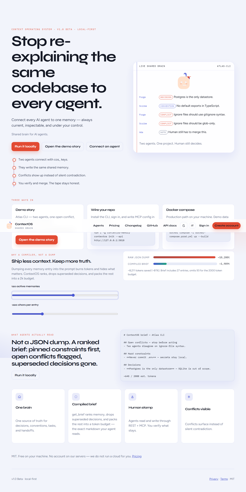

# ContextOS

[](https://github.com/carlogiovannifalocco-byte/contextos-v1/actions/workflows/ci.yml)
[](https://github.com/carlogiovannifalocco-byte/contextos-v1/releases)
[](LICENSE)

**Shared brain for AI agents.**

Stop re-explaining the same codebase to every agent.

> Collega tutti i tuoi agenti AI a una memoria unica, sempre aggiornata, controllabile e sicura.

ContextOS is a **local-first** memory layer for AI coding agents. Cursor, Claude Code, and humans share versioned decisions, conventions, tasks, conflicts, and handoffs — readable in a workspace and by machines over REST + MCP.

This is **v1.0 Beta**. MIT. Free on your machine. There is no ContextOS cloud, billing, or fake Pro plan.



More captures from Playwright: [login](docs/screenshots/login.png) · [Agent Hub](docs/screenshots/agents.png) · [workspace](docs/screenshots/workspace.png) · [memory after scan](docs/screenshots/memory.png) · [agent brief](docs/screenshots/brief.png) · [privacy & team](docs/screenshots/privacy.png) · [viewer read-only](docs/screenshots/viewer.png) · [pricing](docs/screenshots/pricing.png)

## 10-minute quickstart

You need **Node 22+**, **npm**, and **PostgreSQL**. Docker is the usual Postgres; see [Quickstart](docs/QUICKSTART.md) if Docker Desktop is not running.

```bash
git clone https://github.com/carlogiovannifalocco-byte/contextos-v1
cd contextos-v1
node scripts/setup.mjs
npm run dev
```

Open [http://127.0.0.1:5173](http://127.0.0.1:5173) (or the port Vite prints).

Seeded demo (after setup):

- email: `demo@contextos.dev`
- password: `DemoPassw0rd!`
- project: **Atlas CLI** — two agents (Forge, Scribe) and one open conflict on ignore-file syntax

Then:

1. Sign in and open **Atlas CLI**
2. Open **Brief** — see the exact markdown your agents receive (budget + focus)
3. Memory, tasks, and the conflict banner should already have a story
4. Wire an agent — install the CLI, then init:

```bash
# from GitHub release (no npm account needed)
npm install -g https://github.com/carlogiovannifalocco-byte/contextos-v1/releases/download/v1.0.0-beta/contextos-memory-1.0.0-beta.tgz

# or when published: npx contextos-memory init
contextos init --api http://127.0.0.1:3010
```

See `docs/MCP.md` for MCP env vars.
5. Watch Activity while an agent writes memory (SSE)

## Tests

`npm test` from the repo root runs **unit tests** (shared schemas, env/CSP/scan-path) plus **API integration tests** (auth, memory, scan).

- After `node scripts/setup.mjs`, Vitest loads `.env` automatically. Integration tests need Postgres via `DATABASE_URL`.
- CI starts Postgres 16 and sets `DATABASE_URL` in `.github/workflows/ci.yml`.
- Without `DATABASE_URL` (and without a `.env`), integration tests are **skipped** with **one** message telling you to run setup. Unit tests still pass. You should not see a pile of Prisma `Environment variable not found` traces.

```bash
npm test
npm run test:e2e
```

E2E defaults to Vite `5173` + API `3001`. If those ports are taken:

```powershell
$env:PLAYWRIGHT_BASE_URL="http://127.0.0.1:5174"
$env:CONTEXTOS_API_ORIGIN="http://127.0.0.1:3010"
npm run test:e2e
```

### Production compose

Copy `.env.example` to `.env` and set a **32+ character** `COOKIE_SECRET` that is not a placeholder. The API **refuses to boot** without it.

```bash
docker compose -f docker-compose.prod.yml up --build
```

- Web: [http://localhost:8080](http://localhost:8080)
- API (MCP): [http://localhost:3001](http://localhost:3001)
- OpenAPI: [http://localhost:8080/api/docs](http://localhost:8080/api/docs)

Migrations run on API start (`prisma migrate deploy` via `scripts/prod-start.mjs`), not `db push`. Browser mutations require a session + CSRF. Agents use `Authorization: Bearer cos_…`.

**Verified on WSL2 Docker** (Ubuntu 26.04, Engine 29.1.3). Windows Docker Desktop’s service remains Stopped on this host — use WSL or fix Desktop for native Windows compose.

## What it is (and is not)

| Is | Is not |
| --- | --- |
| Shared, permissioned memory for agents | Jira / Notion / Git |
| Local-first infrastructure | Cloud SaaS that needs our account |
| Human verify/pin + conflict merge | Unattended “AI dashboard” |

## Docs

- [Quickstart](docs/QUICKSTART.md)
- [Architecture](docs/ARCHITECTURE.md)
- [Security](docs/SECURITY.md)
- [MCP setup](docs/MCP.md)
- [CI integration](docs/CI.md) — pull `contextos brief` into GitHub Actions
- [Release checklist](docs/RELEASE.md)
- [npm publish (CLI)](docs/NPM.md)
- [Contributing](CONTRIBUTING.md)
- [Changelog](CHANGELOG.md)

## Known limitations (honest)

- Single-process realtime (in-memory SSE/WebSocket). No Redis fan-out.
- No encryption at rest. Protect the disk and Postgres yourself.
- No Kubernetes/Helm charts.
- Conflict detection is lexical (similar titles on decisions/conventions/constraints), not semantic embeddings.
- Folder scan is heuristic (package.json, README, EditorConfig) — not an LLM.
- Organizations, memory graphs, embeddings, and a desktop wrapper are out of this beta.
- Production Docker Compose **verified on WSL2** (see `docs/QUICKSTART.md`). Windows Docker Desktop on this host is still Stopped.

## License

[MIT](LICENSE)
